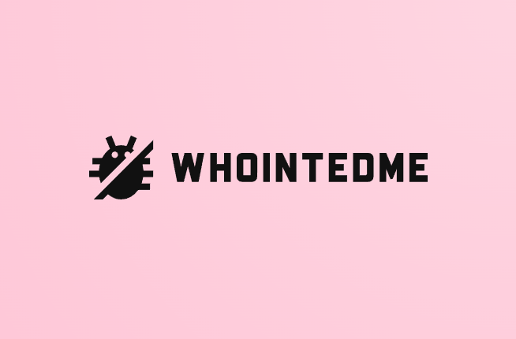

# WhoIntedMe


This is WhoIntedMe, a fullstack application designed to help League of Legends players determine who inted their game! With WhoIntedMe, we utilize statistical machine learning and data analysis to accurately identify who inted your ranked games. Now you can hold your teammates accountable with FACTS and LOGIC.

## 🚀 Soon to be features

- Accurate Int Feed Detection
- Visualize Gameplay Patterns
- Advanced Player Insights

## 🔗 Developers

- 🧙‍♂️ Lead Developer: [@Robin Simpson](https://github.com/TeachMeTW)
- 🧑‍💻 Backend Developer: [@Sebastian Sliva](https://github.com/Cybiii)
- 👨‍💻 Frontend Developer: [@Jay Chong](https://github.com/Kizum1)

## Tech Stack

### Front-End:


## Back-End:


## Database:


## API Reference

Access our API to retrieve League of Legends match data:

```http
GET /api/riot

